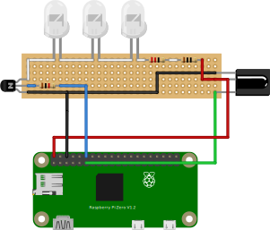
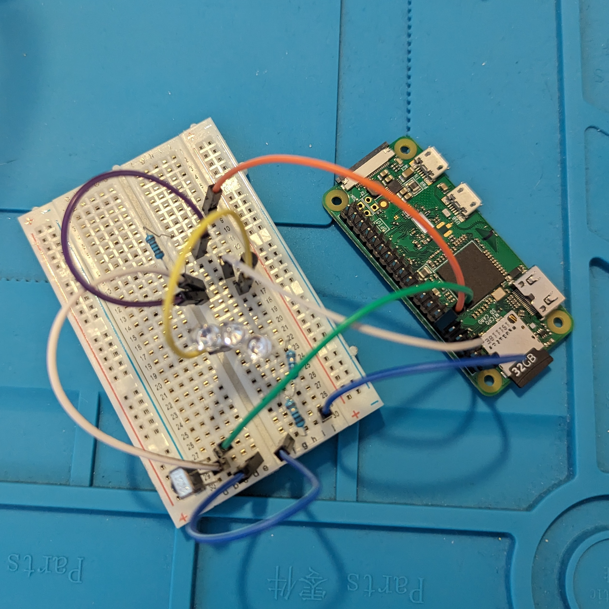
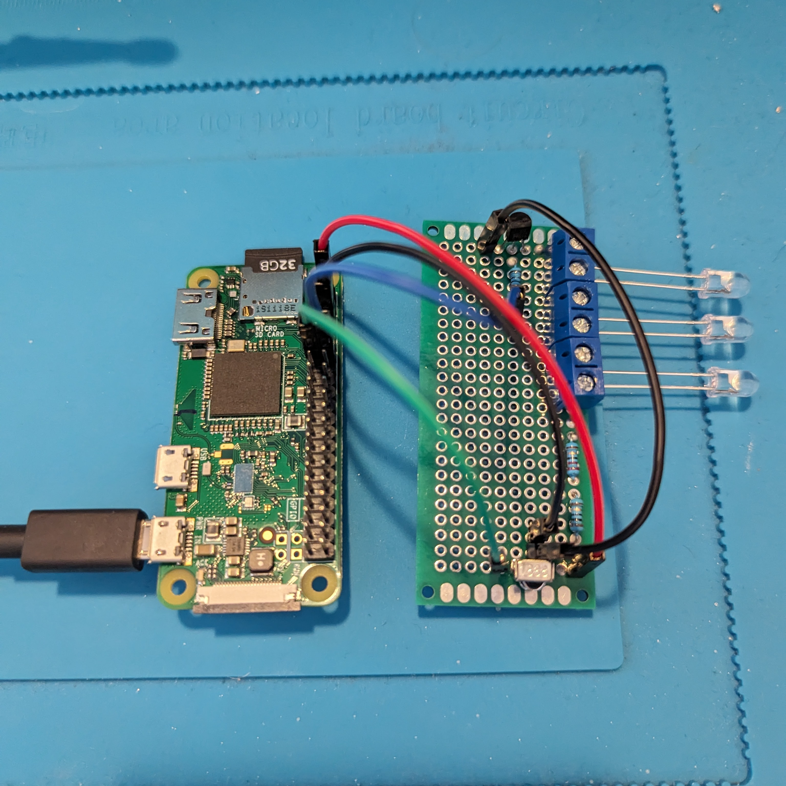

# openHARMONIE - OPEN source Home Automation ReMote cONtrol Infrared Emitter

⚠️ Work in progress ⚠️

## Goal

With this project the Logitech Harmony Hub should be rebuilt as a proof of concept.

It should be possible to start different activities (watch TV, watch Fire TV, watch Bluray, ...) from a web UI/app (virtual openHARMONIE remote), Alexa voice commands or a physical remote.

## Motivation and background

The Logitech Harmony was deprecated a few years ago, no new hardware is sold anymore. The servers are still running, but it's not clear how long this will be the case.

My home automation heavily relies on the integration of the Harmony into openHAB, e.g. to automatically dim/brighten lights if a stream is played on the Fire TV (done with complicated adb magic...).
Or to mute certain notification events on the LaMetric time while watching TV/streaming.

Additionally I have a complex setup with HDMI switches and splitters for sound and a self built Ambilight clone.

That's why I'm looking for an alternative. And what could be better than building it on my own :)

## Overview

- Logic implementation (which activity needs which devices in which states, ...) will be done with openHAB running on a Raspberry Pi 4.
- Sending of IR commands to devices will be done with a Raspberry Pi Zero W.
- Receiving of IR commands will also be done with the Pi Zero W.
- Communication between both Raspberrys will be done with MQTT.

### Current state of project

- ✅ Hardware setup
- ✅ MQTT setup
- ✅ Recording of IR commands from physical remotes
- ✅ Send remote control command from openHAB to a device
- ✅ Receive remote control command from additional physical remote
- ✅ Activity logic
- ✅ UI on smartphone (openHAB sitemaps)
- ✅ Alexa commands
- 0️⃣ 3D printed housing
- 0️⃣ Refactor code to node modules
- 🚧 Refactor documentation and move to a repository
- 0️⃣ Add pictures to the documentation
- 0️⃣ Bluetooth support

## Prerequisites

Building this is for experts and a good amount of time, nerves and coffee is necessary.
It took me almost three months to figure everything out and implement it.

### Skills and basic software setup

- openHAB (Openhabian) is set up and running on Raspberry Pi 4 (Bullseye with openHAB 4.1.1 at time of writing)
- openHAB has the JavaScript binding installed and the openhab_rules_tools
- Knowledge about how to use openHAB is already available
- Raspbian Lite is set up and running on Raspberry Pi Zero W (Bullseye)
- Knowledge about basic Linux commands is already available
- Knowledge how to solder stuff on a circuit board is already available

### Necessary hardware

- Raspberry Pi 4 (or anything else where openHAB is running)
- Raspberry Pi Zero W
- IR Receiver VS1838B
- IR LEDs (3 at least)
- some resistors
- 2N2222 transistor
- some (2-wire) cables
- circuit board for IR hardware
- soldering equipment
- spare remote control, e.g. from a no longer used TV (will be the "physical" openHARMONIE remote control)

## Basic MQTT Setup

- Broker (Mosquitto) is running on openHAB Raspberry Pi
- openHAB is Publisher (MQTT Client)
- Shell Script on Pi Zero W is Subscriber (MQTT Client)

Note: with this setup, you can easily add multiple Pi Zero W for different rooms and control them all from openHAB.

### Setup MQTT Broker (running on openHAB Raspberry Pi 4)

- Install `mosquitto`:

  `$ sudo apt update && sudo apt install mosquitto` (possible via openhabian-config as well)

- Configure mosquitto:

  `$ sudo vi /etc/mosquitto/conf.d/local.conf`

  Add lines:
    ```bash
    listener 1883
    allow_anonymous false
    password_file /etc/mosquitto/credentials
    ```

- Create credentials for openHAB client and shell script client (optional):

  `$ sudo mosquitto_passwd -b /etc/mosquitto/credentials pi pi`

  `$ sudo mosquitto_passwd -b /etc/mosquitto/credentials oh oh`

- Restart broker

  `$ sudo systemctl restart mosquitto`

### Setup openHAB MQTT (Client)

- Install MQTT Binding
- Add Bridge MQTT Broker with IP 127.0.0.1 and `oh`/`oh` as user/password
- Add Thing topic for sending IR commands to devices (topic to publish)
- Add a channel to this thing
- Add Thing topic for receiving IR commands from additonal hardware remote control (optional, topic to subscribe)
- Add a channel to this thing

Note: We use two separate topics instead of one topic with a commandTopic and stateTopic, because communcation is fire & forget. There is no direct "response" to the stateTopic after the commandTopic was published.

See `/etc/openhab/things/mqttopenharmonie.things`

- Create an item for the `Pi0WHarmonie` channel which can later be updated from rules
- Create an item for the `OHHarmonie` channel which can later be used to process context specific IR commands from the additional hardware remote

See `/etc/openhab/items/openharmonie.items`

### Setup Pi Zero W MQTT (Client)

- Install `mosquitto_sub`:

  `$ sudo apt install mosquitto-client`

### Test the setup

Note: Use the IP of the openHAB Raspberry Pi where `mosquitto` is running instead of `broker.home`.

On Pi Zero W:

- Subscribe to the topic

  `$ mosquitto_sub -h broker.home -t devices/pi0w/harmonie -u pi -P pi`

In openHAB:

- Open API Explorer -> Items -> POST /items/{itemname} -> Try out
- Enter the item name `Send_Harmonie_Command` created above
- Enter string `hello world` in request body
- Execute (= publish to the topic)

➡️ `hello world` is shown on the Pi Zero W command line

## openHAB configuration

For openHAB we need several Things, Items and Rules. Additionally a Sitemap is necessary.

### Communication to Pi Zero W

- 2 String Items for publishing/subscribing to MQTT topics.
These necessary items were already created in the previous step for the MQTT setup.

### Physical remote controls

Necessary for each physical remote control belonging to a physical device:
- 1 Number Item which has all the buttons of the remote as metadata and updates the `Send_Harmonie_Command` MQTT String Item with the `DEVICE BUTTON` combination to be sent

  `TV_HISENSE_EN2BF27H_RemoteControl`, `BLURAY_PLAYER_PIONEER_RemoteControl`, ...

### Physical devices

Necessary for each physical device (TV, Receiver, HDMI switches ...)
- 1 Switch item for power state. If switch item is turned ON/OFF, the physical remote number item is updated to send a power signal

  `TV_HISENSE_EN2BF27H_OnOff`, `BLURAY_PLAYER_PIONEER_OnOff`, ...

- 1 Number item for the input source of the device (HDMI1, HDMI2, ...), e.g. necessary for TVs or HDMI switches

  `TV_HISENSE_EN2BF27H_Input`, `BLURAY_PLAYER_PIONEER_Input`, ...

Note: if the "physical remote" number Item of the device is updated directly via UI (i.e. "a button is pressed on the physical remote"), the switch Item is NOT changed. That's how we can correct device status if IR commands failed

### Virtual openHARMONIE remote

- 1 Number item `OPENHARMONIE_RemoteControl` for the buttons on the virtual openHARMONIE remote, which will be used to control the devices based on the current activity

### Activities

Necessary for Activities (Watch TV, watch Fire TV, ...)
- 1 String Item "Activity starting" which gets an update as soon as an activity is starting

  `OPENHARMONIE_Activity_Starting`

- 1 String Item "Activity started" which gets an update as soon as an activity is fully started

  `OPENHARMONIE_Activity_Started`

Activites are triggered with the `Starting` item. This equals the activity starting channel of the real Harmony.
If the activity is started, we execute different phases and queue their tasks with a `Gatekeeper` from the `openhab_rules_tools`.
These phases are defined for each activity:

- `onExit`: tasks to do before the current activity is changed
- `powerStates`: tasks to set the correct power states for the new activity
- `inputStates`: tasks to set the correct input states for the new activity
- `onEnter`: tasks to do to finish starting the activity
- `onFinish`: tasks which can dynamically be added, e.g. to directly start a favorite TV programm or app

All possible activities are predefined in the metadata of the `OPENHARMONIE_Activity_Starting` item to be selected from the UI.

Activities can then be triggered either by buttons of the physical/virtual openHARMONIE or by Alexa voice commands (or anything else available in openHAB).

### Sitemap

We need some additional groups to add the virtual remotes of the devices to a sitemap.

See `/etc/openhab/etc/sitemaps/openharmonie.sitemap`

Note: The sitemap uses icons which are saved in `/etc/openhab/icons/classic`. This was the only way to get the icons in the openHAB Android app and in the Basic UI.

Additionally, the sitemap uses light controls which are not part of the setup here.

### Voice commands

We need a group with switches which will be available for Alexa.

See `/etc/openhab/etc/items/openharmonie.items`

### Rules

Necessary rules:
- Rule to send a remote control command to the Pi Zero W if a remote control button was pushed (`Remote_Control_Button_Pushed`) (= update MQTT Item with state if a remote control item changes its state)
- Rule to send a command to a target device if the button on the physical/virtual openHARMONIE was pushed (`openHARMONIE_Button_Pushed`)
- Rule to send a command if the power state item of a device changes (`Device_Power_Pushed`)
- Rule to send a command if the input state item of a device changes (`Device_Input_Pushed`)
- Rule to process an incoming IR command via MQTT from the physical openHARMONIE (`IR_Command_Received_Via_MQTT`)
- Rule to start an activity (`openHARMONIE_Activity_Starting`)
- Rule for voice commands (`openHARMONIE_Voice_Commands`)

Rules are written in JavaScript.

### Implementation

Note that some Items (e.g. groups for TV/Reciever, light controls) already exist in my setup from other configuration files.

#### Things

See `/etc/openhab/items/mqttopenharmonie.items`

#### Items

See `/etc/openhab/items/openharmonie.items`


#### JavaScript rule

See `/etc/openhab/automation/js/openharmonie.js`

#### Sitemaps

See `/etc/openhab/sitemaps/openharmonie.sitemap`

## Pi Zero W configuration

### Listener for MQTT commands

#### Shell script as MQTT client

A shell script `mqttsubscriber.sh` is running on the Pi Zero W which is receiving MQTT updates and calls another script to send out IR commands (or adb commands for Fire TV).

The script watches if the `mosquitto_sub` process is still running every 5 seconds; if not, the script exits.

`$ touch ~/openharmonie/mqttsubscriber.sh && chmod +x ~/openharmonie/mqttsubscriber.sh`

See `/home/pi/openharmonie/mqttsubscriber.sh`

#### Turn the MQTT shell script to a system service

- Create a new file `mqttsubscriber.service` in `~/openharmonie`

  See `/home/pi/openharmonie/mqttsubscriber.service`

- Copy the file to the `systemd` configuration folder

  `$ sudo cp mqttsubscriber.service /etc/systemd/system`

- Reload the systemd configuration

  `$ sudo systemctl daemon-reload`

- Enable and start the mqtt subscriber service

  `$ sudo systemctl enable mqttsubscriber.service`
  
  `$ sudo systemctl start mqttsubscriber.service`

- Check that it's running

  `$ systemctl status mqttsbscriber.service`
  ```
  ● mqttsubscriber.service - MQTT Subscriber for remote control commands
      Loaded: loaded (/etc/systemd/system/mqttsubscriber.service; enabled; vendor preset: enabled)
      Active: active (running) since Fri 2024-01-12 12:53:06 CET; 4s ago
    Main PID: 22855 (mqttsubscriber.)
        Tasks: 5 (limit: 414)
          CPU: 94ms
      CGroup: /system.slice/mqttsubscriber.service
              ├─22855 /bin/bash /home/pi/openharmonie/mqttsubscriber.sh
              ├─22856 /bin/bash /home/pi/openharmonie/mqttsubscriber.sh
              ├─22857 /bin/bash /home/pi/openharmonie/mqttsubscriber.sh
              ├─22859 sleep 5
              └─22860 mosquitto_sub -h broker.home -t devices/pi0w/harmonie -u pi -P pi


  Jan 03 13:35:20 pi0w systemd[1]: Started MQTT Subscriber for remote control commands.
  Jan 03 13:35:20 pi0w mqttsubscriber.sh[18885]: Listening...
  ```

### Setup for infrared on Raspberry Pi Zero W

Note that `LIRC` is not necessary on Bullseye.Instead, the kernel already supports multiple IR protocols.

Receiving/sending can be done with `ir-keytable` and `ir-ctl` on Bullseye.

#### Hardware setup

##### Record commands

- VS1838B IR Receiver

1) Connect VCC of IR Receiver to Raspberry Pi Zero W GPIO 5V
2) Connect GND of IR Receiver to Raspberry Pi Zero W GPIO Ground
3) Connect OUT of IR Receiver to Raspberry Pi Zero W GPIO 17

##### Send commands

- 5mm IR Emitter LED (IF = 20 mA, UF = 1.2 to 1.5 V)
- Resistor with (5 V - 1.2 V) / 20 mA = 175 to 190 Ohm (1.5 to 1.2 V LED voltage range)
- 2N2222 transistor
- 1 kOhm resistor for transistor

Connect IR LED to 5 V pin and use a transistor as switch. The transistor is toggled by the GPIO 18 pin.
1) Connect the 190 Ohm resistor to 5 V pin
2) Connect anode of LED to resistor
3) Connect cathode of LED to collector of 2N2222 transistor
4) Connect emitter of transistor to GND pin
5) Connect 1 kOhm resistor to GPIO 18 and base of transistor

Note: You can use three IR Emitter LEDs in a row. The resistor then has to be changed to be in the range of 27 - 75 Ohm (1.5 to 1.2 V LED voltage)
If more than three LEDs are necessary, they have to be put parallel to the existing three. More current is then drawn from the 5 V pin. Research needs to be done how high this current can be :)

##### Wiring diagram



The wiring diagram shows the setup with three IR leds and two resistors with 22 and 10 Ohm.


#### Software setup

##### Enable GPIO pins

- Boot Raspberry Pi Zero W and edit the boot config with the editor of your choice, e.g.

  `$ sudo vi /boot/config.txt`

- Uncomment lines:

  ```
  dtoverlay=gpio-ir,gpio_pin=17
  dtoverlay=gpio-ir-tx,gpio_pin=18
  ```

- Save & exit vi, then reboot

The IR Receiver and IR LED are now controllable with GPIO pin 17 and 18.

##### Setting up symlinks for /dev/lirc0 and /dev/lirc1

The IR receiver/sender devices are randomly assigned at boot by the kernel to devices `/dev/lirc0` and `/dev/lirc1`, that's why we create symlinks for them.
With the symlinks, we have a static name for the devices.

- Get attributes for `/dev/lirc0`

  `$ udevadm info --attribute-walk --path $(udevadm info --query path --name=/dev/lirc0)`

- Get attributes for `/dev/lirc1`

  `$ udevadm info --attribute-walk --path $(udevadm info --query path --name=/dev/lirc1)`

With this we get the `DRIVERS=="gpio_ir_recv"` and `DRIVERS=="gpio-ir-tx"`.

Note the dashes and minus for the DRIVERS!

With this information, we can create a udev configuration file.

- Create a file `/etc/udev/rules.d/80-lirc.rules` with the following content:

  `$ sudo vi /etc/udev/rules.d/80-lirc.rules`
    ```
    SUBSYSTEM=="lirc", KERNEL=="lirc*", DRIVERS=="gpio-ir-tx", SYMLINK+="lirc-tx"
    SUBSYSTEM=="lirc", KERNEL=="lirc*", DRIVERS=="gpio_ir_recv", SYMLINK+="lirc-recv"
    ```

- Then save and exit and reboot the Pi.

  `$ sudo reboot`

After the reboot, the IR receiver should be available at `/dev/lirc-recv` and the IR sender should be available at `/dev/lirc-tx`.

```bash
$ ls -l /dev/lirc*
crw-rw---- 1 root video 251, 0 Dec 30 09:56 /dev/lirc0
crw-rw---- 1 root video 251, 1 Dec 30 09:56 /dev/lirc1
lrwxrwxrwx 1 root root       5 Dec 30 09:56 /dev/lirc-recv -> lirc1
lrwxrwxrwx 1 root root       5 Dec 30 09:56 /dev/lirc-tx -> lirc0
```
We can now use `/dev/lirc-tx` to send IR signals and `/dev/lirc-recv` to receive commands.

##### Record IR commands

- Install `ir-keytable`

  `$ sudo apt install ir-keytable -y`

Note: at time of writing, version `1.20.0` of `ir-keytable` is used.

- Confirm it's running

  `$ ir-keytable`
    ```bash
    Found /sys/class/rc/rc1/ with:
        Name: gpio_ir_recv
        Driver: gpio_ir_recv
        Default keymap: rc-rc6-mce
        Input device: /dev/input/event0
        LIRC device: /dev/lirc1
        Attached BPF protocols: Operation not permitted
        Supported kernel protocols: lirc rc-5 rc-5-sz jvc sony nec sanyo mce_kbd rc-6 sharp xmp imon
        Enabled kernel protocols: lirc rc-5 rc-5-sz jvc sony nec sanyo mce_kbd rc-6 sharp xmp imon
        bus: 25, vendor/product: 0001:0001, version: 0x0100
        Repeat delay = 500 ms, repeat period = 125 ms
    ```

In the example above, the IR receiver is recognized as `/dev/lirc1` and available via the kernel as `rc1`.
This may change after each reboot. We use `rc1` for the following commands.

- Enable all supported kernel protocols for the test

  `$ sudo ir-keytable -p all -s rc1`

- Start the `ir-keytable` test and send an IR command from the remote to the IR receiver.
This is the input of the IR receiver already passed through the kernel.

  ```bash
  $ ir-keytable -t -s rc1
  Testing events. Please, press CTRL-C to abort.
  1253.120088: lirc protocol(rc5): scancode = 0x1c3d toggle=1
  1253.120135: event type EV_MSC(0x04): scancode = 0x1c3d
  1253.120135: event type EV_SYN(0x00).
  1253.230098: lirc protocol(rc5): scancode = 0x1c3d toggle=1
  1253.230144: event type EV_MSC(0x04): scancode = 0x1c3d
  1253.230144: event type EV_SYN(0x00).
  1254.250104: lirc protocol(rc5): scancode = 0x1c3b
  1254.250150: event type EV_MSC(0x04): scancode = 0x1c3b
  1254.250150: event type EV_SYN(0x00).
  1255.440082: lirc protocol(rc5): scancode = 0x1c1f toggle=1
  1255.440121: event type EV_MSC(0x04): scancode = 0x1c1f
  1255.440121: event type EV_SYN(0x00).
  ...
  ```

Test different keys of remote. If the the keycodes are different for different remote control buttons, the kernel can decode the IR signal.

➡️ See section "Codes for supported remotes"

If the keycodes are the same for every button, then the kernel does not support the remote protocol and raw codes need to be captured

➡️ See "Raw codes for unsupported remotes"

###### Codes for supported remotes

If the kernel supports the remote control protocol, the key codes can be written down in a `toml` configuration file for each remote.

While running `$ ir-keytable -t -s rc1`, press each button of the remote and note down its hex code and the protocol of the remote (see example above).
The kernel already decodes the IR command.
Write this into a `toml` file for your remote, e.g.

`/home/pi/openharmonie/remotes/toml/HAUPPAUGE_PTR005.toml`

If a remote sends two codes for each button press, we can note them as e.g. `REMOTE_POWER_1` and `REMOTE_POWER_2` in the `toml` file.

Note: the `toml` file can also be loaded to the kernel. Then it's possible to react to the IR control on the Raspberry Pi, e.g. power down the Raspberry Pi when `KEY_POWER` is pressed. If you want to control the Raspberry Pi with a remote control, you have to give key/button names which the kernel can map to commands (e.g. KEY_POWER will shut down the Pi).

We will use this to receive IR commands from a remote control which is not used by any device. The IR command received on the Pi Zero W can be sent to openHAB via MQTT and from there we can execute context specific commands. E.g. send back play/pause depending on the current activity to either the cable receiver, the Fire TV or the Bluray player via MQTT to the Pi Zero W.

###### Raw codes for unsupported remotes

If the kernel does not support the remote control protocol, the raw IR signal needs to be captured and transmitted. Capturing/sending has to be done in the `mode2` format. I couldn't get `toml` files with raw codes working.

All in all capturing the raw signals was really challenging most likely because of the "analogue" path from original remote control to the IR receiver.

- Capture a button press to a file in mode2 format

  `$ ir-ctl -d /dev/lirc-recv --mode2 --receive=REMOTE_POWER.txt`

- After the button on the remote was pressed, end the recording with `Ctrl+c`.

The file `REMOTE_POWER.txt` then contains multiple raw IR signals which consist of `pulse` and `pause` lines and are separated by a `timeout` between two signals.
The `timeout` is ignored during sending.

After the file for one button was recorded, test immediately if the signal can be sent to the device, see section "Sending commands not supported by the kernel" below.

If the device does not react correctly or not at all, try to record the raw signal again (e.g. try with longer/shorter button press). Repeat this until the device recognizes the command.

This can be really annoying and I had to capture the signals of the buttons several times until the signals were properly received at the device.

For some buttons, I even recorded their signal 10-20 times in separate files for each button press. Then I checked which of the files could be used to send the command to the device. From these files, I calculated the average pulse/pause length of each pulse/pause line and saved this in a new file. Then I tested if this "average length" file could be used to send the command, which was fortunately always ok.

##### Send IR commands

Sending is done with `ir-ctl`.

###### Sending commands supported by the kernel

Sending a code can be done with:

  `$ ir-ctl -d /dev/lirc-tx -k TV_HISENSE_EN2BF27H.toml -K REMOTE_POWER`

The configuration file and the button need to be passed.

If a remote sends two codes for a button press, we have to add them both with another `-K`:

  `$ ir-ctl -d /dev/lirc-tx -k BLURAY_PLAYER_PIONEER.toml -K BUTTON_1 -K BUTTON_2`

###### Sending raw commands not supported by the kernel

Sending a code can be done with:

  `$ ir-ctl -d /dev/lirc-tx --send=KEY_NAME.txt`

The file with the pulses and spaces needs to be passed.

##### Wrapper script to send commands of different remote controls

Now we bring all of this together in one script which can be called by the MQTT subscriber script running on the Raspberry Pi Zero W.

To realize this, put all files in a folder with the following structure. Supported remotes are put into the `toml` folder, unsupported remotes are put in the `raw` folder.

Additionally, for each device a shell script is written which gets the key name passed. In the script, the correct amount of codes to be sent has to be configured. Make the scripts executable with `chmod`.
Files which were not explained yet will be covered later.

```bash
~
|
- openharmonie
  |
  - mqttsubscriber.sh
  - mqttsubscriber.service
  |
  - remotes
    |
    - toml
    | |
    | - TV_HISENSE_EN2BF27H.toml
    | - BLURAY_PLAYER_PIONEER.toml
    | ...
    - raw
    | |
    | - RECEIVER_SAMSUNG_KD
    | | |
    | | - REMOTE_POWER.txt
    | | - REMOTE_MENU.txt
    | | - ...
    | - ...
    - thd
    | |
    | - openharmonie.conf
    |
    - keys
    | |
    | - keymap.sh
    | - keymap_fallback.sh
    |
    - receive_command.sh
    - send_command.sh
    - TV_HISENSE_EN2BF27H.sh
    - BLURAY_PLAYER_PIONEER.sh
    - RECEIVER_SAMSUNG_KD.sh
    - FIRETV.sh
    ...
```

Examples for different types of devices.

1) Remote control with raw codes:

    `/home/pi/openharmonie/remotes/RECEIVER_SAMSUNG_KD.sh`

2) Remote control with kernel supported codes:

    `/home/pi/openharmonie/remotes/TV_HISENSE_EN2BF27H.sh`

3) Remote control with mixed button behavior:

    - buttons which send a code `0xa6a7` first
    - buttons which send a code `0xa6a0` first
    - buttons which send the code once
    - buttons wich send the code twice

    `/home/pi/openharmonie/remotes/BLURAY_PLAYER_PIONEER.sh`

Additonally we create a `send_command.sh` shell script which is called from the MQTT listener:

  `$ touch ~/remotes/send_command.sh && chmod +x ~/remotes/send_command.sh`

  See `/home/pi/openharmonie/remotes/send_command.sh`

##### Receive IR commands from additional remote

An additional remote will be used to control the whole system depending on the current activity. For this we use a spare remote, e.g. from a device which is no longer used.

###### Reacting to IR input

- Create a `toml` file for this additional remote.
  See `/home/pi/openharmonie/remotes/toml/OPENHARMONIE_TV_PHILIPS.toml`

Note: To not control the Raspberry Pi Zero W with the button presses, we have to choose button names which are not used by the Linux system.
I chose `BTN_TRIGGER_HAPPY` keys and `KEY_MACRO` keys.

- To permanently load this file after a reboot, copy it to the folder `/etc/rc_keymaps`

  `$ sudo cp /home/pi/openharmonie/remotes/toml/OPENHARMONIE_TV_PHILIPS.toml /etc/rc_keymaps`

- Then add it in the `rc_maps.cfg`

  `$ sudo vi /etc/rc_maps.cfg`

  Add the following line to the existing maps:
  ```
  ...
  # Table to automatically load the rc maps for the bundled IR's provided with the
  # devices supported by the linux kernel

  #driver table                    file
  gpio_ir_recv    *       OPENHARMONIE_TV_PHILIPS.toml
  ...
  ```

Now the IR commands sent by the remote can be processed as input events.

###### Processing input events with triggerhappy

Processing the input events is done with `triggerhappy`. The same keycodes have to be used like in the openHARMONIE `toml` file.

- Create a configuration file for `triggerhappy`

  `/home/pi/openharmonie/remotes/thd/openharmonie.conf`

- Copy the file to the triggerhappy config folder

  `$ sudo cp /home/pi/openharmonie/remotes/thd/openharmonie.conf /etc/triggerhappy/triggers.d/openharmonie.conf`

- Restart the triggerhappy service

  `$ sudo systemctl restart triggerhappy.service`

Every input event triggered by the remote executes the `receive_command.sh` with the generic button name.

###### Forwarding input events via MQTT

Forwarding the button name via MQTT to openHAB can be done with a script.

- Create it in the remotes folder

  `$ touch ~/remotes/receive_command.sh && chmod +x ~/remotes/receive_command.sh`

  See `/home/pi/openharmonie/remotes/receive_command.sh`

Then reboot the Pi Zero W. If everything works, you should see an update of the `Receive_Harmonie_Command` item after pressing a button on the remote.

### Setup connection to Fire TV

The Fire TV can be controlled with adb or Bluetooth.
We will use adb for now.

- Install `adb` on the Pi Zero W

  `$ sudo apt update && sudo apt install adb`

- Start the Fire TV and activate developer options somewhere in the settings menu

- Execute the following command to initialize the connection

  `adb connect firetv.home:5555`

  Note: Change `firetv.home` to the IP address of your Fire TV

- A popup is shown on the Fire TV, make sure to set the checkmark and accept the incoming connection.

From now on, we can connect to adb, execute commands and disconnect if the Fire TV is not used.

To control the Fire TV, we will use `adb shell sendevent` to send keycodes to the keyboard input device available on the Fire TV.

This is faster than `adb shell input keyevent` because it doesn't use the Java layer of Android.

Note: This input device `amzkeyboard` suddenly disappeared from my Fire TV after a few days. That's why I added the `input keyevent` as fallback.

With `adb shell sendevent` we can send the key codes available from the Linux kernel: https://github.com/torvalds/linux/blob/master/include/uapi/linux/input-event-codes.h

If the `amzkeyboard` input is not available, we use `input keyevent` as fallback. For this we need to map the key codes of the Linux kernel to the key events of Android: https://developer.android.com/reference/android/view/KeyEvent

To start specific apps, we will use `adb shell am start`.

- Create a shell script for Fire TV commands on the Pi Zero W and make it executable

  `$ touch ~/remotes/FIRETV.sh && chmod +x ~/remotes/FIRETV.sh`

  See `/home/pi/openharmonie/remotes/FIRETV.sh`

- Additionally create two keymap files to look up the numbers of the key names. One for the Linux key codes, the other one to map them to Android key events.

  See `/home/pi/openharmonie/remotes/keys/keymap.sh` and `/home/pi/openharmonie/remotes/keys/keymap_fallback.sh`

Note: The correct activites for apps can be found via adb:

- Connect to the Fire TV

  `$ adb connect firetv.home:5555`

- Search the package name, e.g. for an app called `streamingapp`

  `$ adb shell pm list packages | grep streamingapp`

- If the app cannot be found, list all packages and search it manually

  `$ adb shell pm list packages`

- Get the activity

  `$ adb shell cmd package resolve-activity --brief com.mystreamingapp.app`

- If no activity can be found, try

  `$ adb shell pm dump com.mystreamingapp.app | grep -A 1 "MAIN" | grep com.mystreamingapp.app`

Note: the supported keycodes for the `amzkeyboard` input can be found with
`$ adb shell getevent -lp`

TODO: Sending the `input keyevent` is quite slow, because the `input.jar` needs to be started every time. Sending an event with `sendevent` is faster, but for this the virtual keyboard must be available. It would be better to figure out an alternative control via Bluetooth.

## Alexa voice commands integration

To make everything controllable from Alexa voice commands, a mixture of openHAB items and Alexa routines is necessary.

For every command (e.g. start an activity, start a favorite, pause, play, ...) we need a Switch item with Alexa `ToggleState` metadata.

All these items are in one group with Alexa `Other` metadata.
With this approach, we don't spam the devices inbox of the Alexa app.

The group and its items can then be discovered in the Alexa app. Afterwards, create routines for each voice command.

E.g. for the voice command "TV on" create a routine which turns the "TV" toggle of the "openHARMONIE" device to ON and so on.
For "Pause with openHARMONIE" create a routine which then turns the "Pause" toggle to ON and so on.
This has to be done for every activity, favourite, button press, ...

As alternative, you can move the activity and favorite Items out of the group and have them as standalone "Devices" in Alexa. Then you can directly say on/off for them.
But for single button presses, the Switch items should be part of the group.

Note: If Alexa says that no new device was found, try to change the label texts. They won't be used anyways for the voice commands, just to identify the correct "switch" when creating a routine.

## Starting up

After everything is configured and set up, place the Raspberry Pi Zero W somewhere where it has WIFI access and point the IR LEDs towards your devices.
It's best if the distance to the devices is short.

Then have fun with your new setup!

## Images


Prototype with breadboard


Prototype soldered on board

## License

```
This program is free software: you can redistribute it and/or modify
it under the terms of the GNU General Public License as published by
the Free Software Foundation, either version 3 of the License, or
(at your option) any later version.

This program is distributed in the hope that it will be useful,
but WITHOUT ANY WARRANTY; without even the implied warranty of
MERCHANTABILITY or FITNESS FOR A PARTICULAR PURPOSE.  See the
GNU General Public License for more details.

You should have received a copy of the GNU General Public License
along with this program.  If not, see <https://www.gnu.org/licenses/>.
```